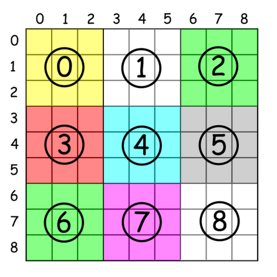

## 36 有效的数独

#### 题目：

判断一个9*9的数独是否有效。只需根据以下规则，验证已经填入的数字是否有效即可。

1. 数字1-9每行只出现一次
2. 数字1-9每列只出现一次
3. 数字1-9在每个以粗实线分隔的3*3宫内只能出现一次。

```
输入:
[
  ["8","3",".",".","7",".",".",".","."],
  ["6",".",".","1","9","5",".",".","."],
  [".","9","8",".",".",".",".","6","."],
  ["8",".",".",".","6",".",".",".","3"],
  ["4",".",".","8",".","3",".",".","1"],
  ["7",".",".",".","2",".",".",".","6"],
  [".","6",".",".",".",".","2","8","."],
  [".",".",".","4","1","9",".",".","5"],
  [".",".",".",".","8",".",".","7","9"]
]
输出: false
解释: 除了第一行的第一个数字从 5 改为 8 以外，空格内其他数字均与 示例1 相同。
     但由于位于左上角的 3x3 宫内有两个 8 存在, 因此这个数独是无效的。
```


##### 解题（哈希表，一遍扫描）：

最简单的解决方案是：扫描三遍，分别把行、列、盒子都检查一下。


现在只需要扫描一遍，把行、列、盒子三个区域全都检查了。

盒子的索引为`(row/3)*3 + col/3`：第一项代表几行盒子，第二项代表这行格子的序号。



```java
public boolean isValidSudoku(char[][] board) {
        HashMap<Integer, Integer>[] rows = new HashMap[9];
        HashMap<Integer, Integer>[] cols = new HashMap[9];
        HashMap<Integer, Integer>[] boxes = new HashMap[9];

        for(int i=0; i<9; i++){
            rows[i] = new HashMap<Integer, Integer>();
            cols[i] = new HashMap<Integer, Integer>();
            boxes[i] = new HashMap<Integer, Integer>();
        }

        for(int i=0; i<9; i++){
            for(int j=0; j<9; j++){
                if(board[i][j] != '.'){
                    int n = (int) board[i][j];
                    int boxes_index = (i/3)*3 + j/3;

                    rows[i].put(n, rows[i].getOrDefault(n, 0) +1);
                    cols[j].put(n, cols[j].getOrDefault(n, 0) +1);
                    boxes[boxes_index].put(n, boxes[boxes_index].getOrDefault(n, 0) +1);

                    if(rows[i].get(n)>1 || cols[j].get(n)>1 || boxes[boxes_index].get(n)>1){
                        return false;
                    }
                }
            }
        }
        return true;
    }
```

